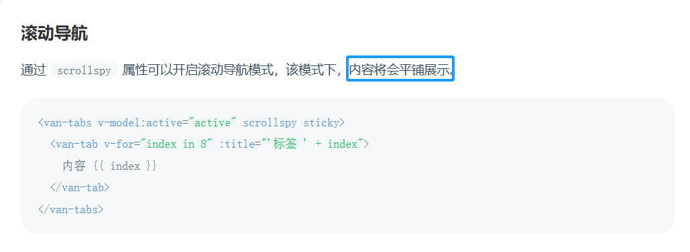
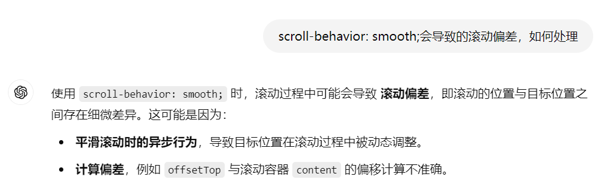

# 原生实现电梯导航

## 背景

最近在做 H5 项目，接触了 Vant 组件库，它有一个 Tab 组件，组件提供了一个属性 scrollspy 来实现滚动导航，也即是常说的电梯导航

```vue
<!-- 官方文档代码模板 -->
<template>
  <van-tabs v-model:active="active" scrollspy sticky>
    <van-tab v-for="index in 8" :title="'标签 ' + index"> 内容 {{ index }} </van-tab>
  </van-tabs>
</template>
```

我只是单看它的效果和我预期的很像，所以就想拿到项目中使用。  
但怎么调试都不行，**顶部导航菜单和底部内容没有任何联动**。  
我开始以为是自己哪里写错了，然后贴了上边的代码模板进去也是无效的。  
我又换了角度想了想，可能是我父容器的样式影响了它的表现，我尝试写了一个测试页面，结果发现了点问题，即：

该组件的父容器不能被限定，它需要在顶层容器中，或者在高度上它不能低于屏幕的高度，这个组件的滑动计算似乎是以全屏计算的。

我大概是这么理解的，因为项目很急，也没有时间去翻看它的源码，我检索了相关的问题，大部分文章都提出了这样的观点：

> 1. 滚动导航的父盒子样式不能有 overflow-y: auto;这个样式会导致滚动导航不生效
>
> 2. vant tabs 组件 设置 sticky scrollspy 属性没有效果  
>    原因出在父元素不管是第几层的父元素 overflow 属性，overflow 不能为 auto 和 hidden  
>    设置完可以正常吸顶和滚动

这种解决方案不适合我，我的滚动范围并不是全屏，所以就算我尝试设置父容器的 overflow 属性，它还是无效的。因为我父容器的高度不是全屏的高度

### 相关链接

- [vue 项目 vant 框架的滚动导航不生效原因](https://blog.csdn.net/weixin_41791737/article/details/106055385?fromshare=blogdetail&sharetype=blogdetail&sharerId=106055385&sharerefer=PC&sharesource=OtherChannel&sharefrom=from_link)
- [vant tabs 组件滚动、吸顶效果失效](https://blog.csdn.net/XNHYJSL/article/details/124710407?fromshare=blogdetail&sharetype=blogdetail&sharerId=124710407&sharerefer=PC&sharesource=OtherChannel&sharefrom=from_link)

其实这里已经很明显的提示了  


## 手动实现电梯导航

先把全部代码贴出来， 我把调试的代码都注释掉了，只保留核心代码，方便阅读。

```vue
<template>
  <div class="elevator-nav">
    <!-- 导航栏 -->
    <ul class="nav">
      <li
        v-for="(item, index) in sections"
        :key="index"
        :class="{ active: activeSection === index }"
        @click="scrollToSection(index)">
        {{ item.title }}
      </li>
    </ul>

    <!-- 内容区域 -->
    <div class="content" ref="content">
      <div v-for="(item, index) in sections" :key="index" :id="'section-' + index" class="section">
        <h2>{{ item.title }}</h2>
        <p>{{ item.content }}</p>
      </div>
    </div>
  </div>
</template>
<script>
  import { ref, onMounted, onUnmounted, useTemplateRef } from "vue"

  export default {
    setup() {
      const sections = ref([
        { title: "部分 1", content: "这是部分 1 的内容" },
        { title: "部分 2", content: "这是部分 2 的内容" },
        { title: "部分 3", content: "这是部分 3 的内容" },
        { title: "部分 4", content: "这是部分 4 的内容" },
      ])

      const activeSection = ref(0)
      const contentRef = useTemplateRef("content") // 获取内容区域的 DOM 引用

      // 滚动到指定的部分
      const scrollToSection = (index) => {
        const content = contentRef.value // 获取内容容器

        const section = document.querySelector(`#section-${index}`)
        if (section && content) {
          const offsetTop = section.offsetTop - content.offsetTop
          console.log("Scroll to section:", index, "Offset:", offsetTop)

          // 使用 content.scrollTo 实现容器内的滚动，而不是 window.scrollTo
          content.scrollTo({
            top: offsetTop,
            behavior: "smooth",
          })
        }
      }

      // 检测滚动位置
      const handleScroll = () => {
        const content = contentRef.value
        const scrollPosition = content.scrollTop // 获取容器的滚动位置
        const sectionElements = sections.value.map((_, index) =>
          document.querySelector(`#section-${index}`)
        )

        sectionElements.forEach((section, index) => {
          const sectionTop = section.offsetTop - content.offsetTop // 相对于内容容器顶部的偏移
          const sectionBottom = sectionTop + section.clientHeight

          if (scrollPosition >= sectionTop && scrollPosition < sectionBottom) {
            activeSection.value = index
          }
        })
      }

      // 监听内容容器的滚动事件
      onMounted(() => {
        const content = contentRef.value
        if (content) {
          content.addEventListener("scroll", handleScroll)
        }
      })

      onUnmounted(() => {
        const content = contentRef.value
        if (content) {
          content.removeEventListener("scroll", handleScroll)
        }
      })

      return {
        sections,
        activeSection,
        scrollToSection,
        contentRef,
      }
    },
  }
</script>
<style scoped>
  .elevator-nav {
    display: flex;
    height: 300px;
    overflow: hidden;
  }

  .nav {
    list-style-type: none;
    margin: 0;
    padding: 0;
    width: 200px;
    position: fixed;
  }

  .nav li {
    cursor: pointer;
    padding: 10px;
    margin-bottom: 5px;
    background-color: #f0f0f0;
  }

  .nav li.active {
    background-color: #007bff;
    color: white;
  }

  .content {
    margin-left: 220px;
    overflow-y: auto; /* 确保内容区域有滚动条 */
    height: 300px; /* 高度限制 */
  }

  .section {
    height: 600px; /* 确保内容足够长以产生滚动 */
    padding: 20px;
    /* border-bottom: 1px solid #ccc; */
  }
</style>
```

在实现的过程中遇到了一个问题，点击左侧导航按钮可以让右侧内容区滚动，但是滚动结束的位置总是有偏差。  
并且会随着滚动的跨越高度而递增，从而导致左侧按钮选中样式的异常--无法正常与内容区的滚动位置对应。

我一开始的思考方向是，滚动 API 的实现有微小的偏差，然后我问了 GPT：  
  
可能是我这样的询问对 GPT 有错误的影响，其实 `scroll-behavior: smooth;` 滚动过程中不会导致 **滚动偏差**

在这个错误的方向上，我尝试了：

1. 使用 `netTick` 或 `setTimeout` 来在滑动结束后，重新定位到正确的位置。但不行
2. 手动实现平滑效果， 但不行

当我准备妥协的添加缓冲区（容错区）的时候，突然想到之前看的那本书 《CSS 的世界》 中提到了容器或盒子的宽度是有内外之分的  
我们设置的宽度一般而言，指的都是内部的宽度，这个分界线在 `box-sizing` 的 `content-box` 模式下，是 `width` 宽度，在 `border-box` 模式下，是 `width + padding + border`  
我想，既然宽度如此，那么一定程度上已经固定好的高度同样也会受到影响。 我查看了代码

```css
.section {
  height: 600px; /* 确保内容足够长以产生滚动 */
  padding: 20px;
  /* border-bottom: 1px solid #ccc; */
}
```

在最后一行，设置了 `border-bottom` 有可能是在滑动定位的时候，没有算上 border 的高度，但是我计算的方法中又有这个边框高度，导致两者对不上  
这样的话，跨越层级越多，导致的偏差越大的问题也可以解释

我当即注释了这段，结果就正常了哈哈哈
