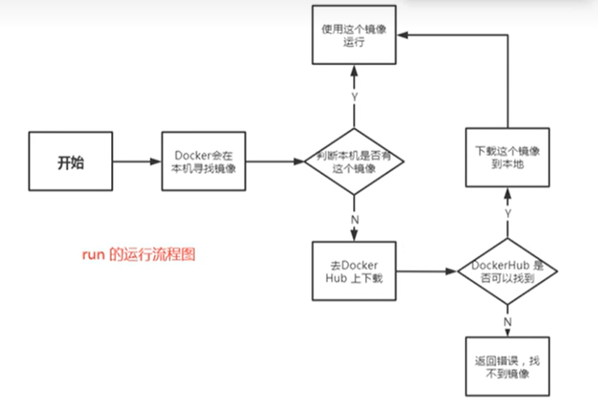
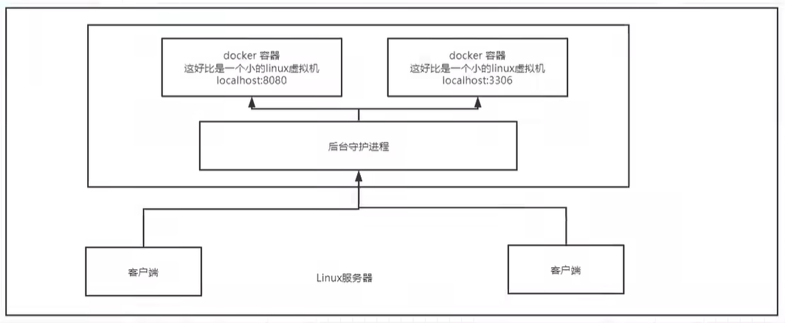
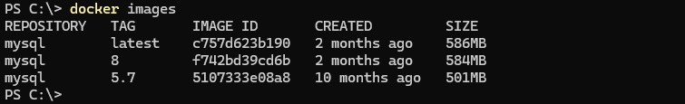
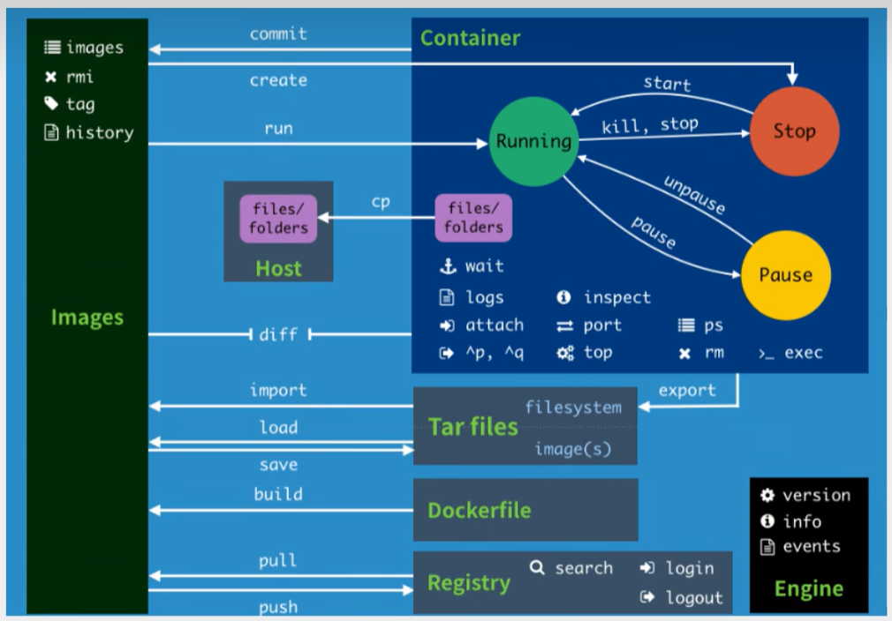
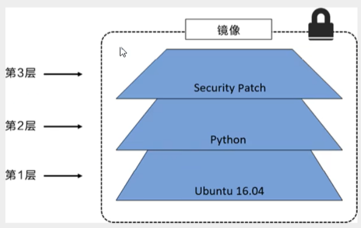

## Docker 的基本组成

**镜像(image)**:  
docker 镜像就好比是一个模板，可以通过这个模板来创建容器服务，tomcat 镜像 ===> run ===> tomcat 容器(提供服务器)  
**容器(container)**:  
docker 利用容器技术，独立运行一个或一组应用，通过镜像来创建。  
**仓库(registry)**:  
仓库就是存放镜像的地方，仓库分为公有和私有仓库

## 安装 Docker

## Docker 底层原理

### docker 是怎么工作的



Docker 是一个 Client-Server 结构的系统，Docker 的守护进程运行在主机上。 通过 Socket 从客户端访问!  
DockerServer 接收到 Docker-Client 的指令，就会执行这个命令!  


### Docker 为什么比 VM 快

docker 和 VM 都是虚拟化，但是 VM 是虚拟一个完整的操作系统，而 docker 是虚拟一个文件系统  
docker 利用的是宿主机的内核，而 VM 则需要是 Guest OS

## Docker 常用命令

### 帮助命令

```shell
docker version # 查看版本信息
docker info # 查看docker的系统信息，包括镜像和容器数量
docker 命令 --help # 查看命令的帮助信息
```

[帮助文档](https://docs.docker.com/engine/reference/commandline/)

### 镜像命令

**docker images** 查看所有本地主机上的镜像

```shell
PS C:\> docker images
REPOSITORY   TAG       IMAGE ID   CREATED   SIZE

# 解释
REPOSITORY   镜像的仓库源
TAG          镜像的标签
IMAGE ID     镜像的id
CREATED      镜像的创建时间
SIZE         镜像的大小

# 可选项
-a，--a11     # 列出所有镜像
-q，--quiet   # 只显示镜像的id

```

**docker search** 搜索镜像

```shell
PS C:\> docker search mysql
NAME                   DESCRIPTION                                      STARS     OFFICIAL
mysql                  MySQL is a widely used, open-source relation…   15419     [OK]
mysql/mysql-server     Optimized MySQL Server Docker images. Create…   1020

#可选项，通过搜藏来过滤
--filter=STARS=3000  # 搜索出来的镜像就是STARS大于3000的
```

**docker pull** 下载镜像

```shell
#下载镜像 docker pull 镜像名[:tag]

PS C:\> docker pull mysql
Using default tag: latest # 不加标签默认下载latest
latest: Pulling from library/mysql
eba3c26198b7: Pull complete # 分层下载，docker iamge的核心 联合文件系统
fc6c33853069: Pull complete
f1fa3ee22bea: Pull complete
5b8b24615ae8: Pull complete
cded0449fb1a: Pull complete
095378692b4a: Pull complete
110d87e5d2a3: Pull complete
bd1dbbbda514: Pull complete
982f92841ea3: Pull complete
de34c1fda3aa: Pull complete
Digest: sha256:92dc869678019f65d761155dacac660a904f6245bfe1b7997da0a73b2bfc68c9 # 签名
Status: Downloaded newer image for mysql:latest
docker.io/library/mysql:latest # 真实地址

# 等价于
docker pull mysql
docker pull docker.io/library/mysql:latest

# 指定版本下载
PS C:\> docker pull mysql:8
8: Pulling from library/mysql
eba3c26198b7: Already exists # 复用部分镜像
fc6c33853069: Already exists
773855fa856d: Pull complete
b3b5068022ec: Pull complete
627a78504886: Pull complete
e8ce992a870e: Pull complete
70b702ee9d46: Pull complete
60b30f90bce1: Pull complete
8ed80156b17c: Pull complete
850c36b0e995: Pull complete
Digest: sha256:ac80b6e09e5b12b4f9d5cd4f6425e43464247aa4ba4f6169da5daf59e5877f7d
Status: Downloaded newer image for mysql:8
docker.io/library/mysql:8
```



**docker rmi** 删除镜像

```shell
docker rmi -f 容器id # 删除指定的容器
docker rmi -f 容器id 容器id 容器id 容器id # 删除多个容器
docker rmi-f $(docker images -aq) # 删除全部的容器
```

### 容器命令

**新建容器并启动**

```shell
docker run [可选参数] image

# 参数说明
# --name='Name' 容器名字 tomcat01 tomcat02，用来区分容器
# -d            后台方式运行
# -it           使用交互方式运行，进入容器查看内容
# -p            端口映射 指定容器的端口 -p8080:8080
#   -p ip:主机端口:容器端口
#   -p 主机端口:容器端口 (常用)
#   -p 容器端口
# -Pv           随机指定端口

# 测试，启动并进入容器
PS C:\> docker run -it centos /bin/bash
[root@def25701111f /]#

# 从容器中退回主机
[root@def25701111f /]# exit
```

**列出所有的运行的容器**

```shell
# docker ps 命令 列出当前正在运行的容器
# -a   列出当前正在运行的容器+带出历史运行过的容器
# -n=? 显示最近创建的容器
# -q   只显示容器的编号
```

**退出容器**

```shell
exit      # 直接容器停止并退出
Ctrl+P+Q  # 容器不停止退出
```

**删除容器**

```shell
docker rm 容器id                # 删除指定的容器，不能删除正在运行的容器，如果要强制删除rm -f
docker rm-f $(docker ps -aq)   # 删除所有的容器
docker ps -a -q|xargs docker rm  #删除所有的容器
```

**启动和停止容器的操作**

```shell
docker start 容器id     # 启动容器
docker restart 容器id   # 重启容器
docker stop 容器id      # 停止当前正在运行的容器
docker ki11 容器id      # 强制停止当前容器
```

**常用其他命令**

后台启动容器

```shell
PS C:\> docker run -d centos
6de09343e336680ec42823955fce82e70b4a40efa359cf733abad80afac26f8e
# 问题： docker ps 发现 centos 停止了
# 原因： docker 容器使用后台运行，就必须要有要一个前台进程，docker发现没有应用，就会自动停止
# nginx，容器启动后，发现自己没有提供服务，就会立刻停止，就是没有程序了

```

查看日志

```shell
docker logs -f -t --tail 10 容器id # 容器没有日志

docker run centos /bin/sh -c "while true;do echo shaa;sleep 1;done"

-tf # 跟踪日志
--tail=10 # 显示最后10行日志
```

**查看容器中进程信息 ps**

```shell
# docker top 容器id
PS C:\> docker top 79344492348f
```

**查看镜像的元数据**

```shell
# docker inspect 容器id
PS C:\> docker inspect 79344492348f
[
    {
        "Id": "79344492348f8e4c500452d4892dd67f22ecb8b207bfe005bf8228e83559fdf8",
        "Created": "2024-10-14T05:42:51.986918882Z",
        "Path": "/bin/sh",
        "Args": [
            "-c",
            "while true;do echo shaa;sleep 1;done"
        ],
        "State": {
            "Status": "running",
            "Running": true,
            "Paused": false,
            "Restarting": false,
            "OOMKilled": false,
            "Dead": false,
            "Pid": 6136,
            "ExitCode": 0,
            "Error": "",
            "StartedAt": "2024-10-14T05:42:52.197298199Z",
            "FinishedAt": "0001-01-01T00:00:00Z"
        },
        "Image": "sha256:5d0da3dc976460b72c77d94c8a1ad043720b0416bfc16c52c45d4847e53fadb6",
        "ResolvConfPath": "/var/lib/docker/containers/79344492348f8e4c500452d4892dd67f22ecb8b207bfe005bf8228e83559fdf8/resolv.conf",
        "HostnamePath": "/var/lib/docker/containers/79344492348f8e4c500452d4892dd67f22ecb8b207bfe005bf8228e83559fdf8/hostname",
        "HostsPath": "/var/lib/docker/containers/79344492348f8e4c500452d4892dd67f22ecb8b207bfe005bf8228e83559fdf8/hosts",
        "LogPath": "/var/lib/docker/containers/79344492348f8e4c500452d4892dd67f22ecb8b207bfe005bf8228e83559fdf8/79344492348f8e4c500452d4892dd67f22ecb8b207bfe005bf8228e83559fdf8-json.log",
        "Name": "/eloquent_ptolemy",
        "RestartCount": 0,
        "Driver": "overlay2",
        "Platform": "linux",
        "MountLabel": "",
        "ProcessLabel": "",
        "AppArmorProfile": "",
        "ExecIDs": null,
        "HostConfig": {
            "Binds": null,
            "ContainerIDFile": "",
            "LogConfig": {
                "Type": "json-file",
                "Config": {}
            },
            "NetworkMode": "bridge",
            "PortBindings": {},
            "RestartPolicy": {
                "Name": "no",
                "MaximumRetryCount": 0
            },
            "AutoRemove": false,
            "VolumeDriver": "",
            "VolumesFrom": null,
            "ConsoleSize": [
                29,
                101
            ],
            "CapAdd": null,
            "CapDrop": null,
            "CgroupnsMode": "host",
            "Dns": [],
            "DnsOptions": [],
            "DnsSearch": [],
            "ExtraHosts": null,
            "GroupAdd": null,
            "IpcMode": "private",
            "Cgroup": "",
            "Links": null,
            "OomScoreAdj": 0,
            "PidMode": "",
            "Privileged": false,
            "PublishAllPorts": false,
            "ReadonlyRootfs": false,
            "SecurityOpt": null,
            "UTSMode": "",
            "UsernsMode": "",
            "ShmSize": 67108864,
            "Runtime": "runc",
            "Isolation": "",
            "CpuShares": 0,
            "Memory": 0,
            "NanoCpus": 0,
            "CgroupParent": "",
            "BlkioWeight": 0,
            "BlkioWeightDevice": [],
            "BlkioDeviceReadBps": [],
            "BlkioDeviceWriteBps": [],
            "BlkioDeviceReadIOps": [],
            "BlkioDeviceWriteIOps": [],
            "CpuPeriod": 0,
            "CpuQuota": 0,
            "CpuRealtimePeriod": 0,
            "CpuRealtimeRuntime": 0,
            "CpusetCpus": "",
            "CpusetMems": "",
            "Devices": [],
            "DeviceCgroupRules": null,
            "DeviceRequests": null,
            "MemoryReservation": 0,
            "MemorySwap": 0,
            "MemorySwappiness": null,
            "OomKillDisable": false,
            "PidsLimit": null,
            "Ulimits": [],
            "CpuCount": 0,
            "CpuPercent": 0,
            "IOMaximumIOps": 0,
            "IOMaximumBandwidth": 0,
            "MaskedPaths": [
                "/proc/asound",
                "/proc/acpi",
                "/proc/kcore",
                "/proc/keys",
                "/proc/latency_stats",
                "/proc/timer_list",
                "/proc/timer_stats",
                "/proc/sched_debug",
                "/proc/scsi",
                "/sys/firmware",
                "/sys/devices/virtual/powercap"
            ],
            "ReadonlyPaths": [
                "/proc/bus",
                "/proc/fs",
                "/proc/irq",
                "/proc/sys",
                "/proc/sysrq-trigger"
            ]
        },
        "GraphDriver": {
            "Data": {
                "LowerDir": "/var/lib/docker/overlay2/3b03cae73cd1ad3ec9db5e9e0322b59f4ceeaf145e06ff959d77133e08ac6b04-init/diff:/var/lib/docker/overlay2/38e7aa6aaad1ceaebbca47332d6b731b24e325660bb5a010124ff0447d131b53/diff",
                "MergedDir": "/var/lib/docker/overlay2/3b03cae73cd1ad3ec9db5e9e0322b59f4ceeaf145e06ff959d77133e08ac6b04/merged",
                "UpperDir": "/var/lib/docker/overlay2/3b03cae73cd1ad3ec9db5e9e0322b59f4ceeaf145e06ff959d77133e08ac6b04/diff",
                "WorkDir": "/var/lib/docker/overlay2/3b03cae73cd1ad3ec9db5e9e0322b59f4ceeaf145e06ff959d77133e08ac6b04/work"
            },
            "Name": "overlay2"
        },
        "Mounts": [],
        "Config": {
            "Hostname": "79344492348f",
            "Domainname": "",
            "User": "",
            "AttachStdin": false,
            "AttachStdout": true,
            "AttachStderr": true,
            "Tty": false,
            "OpenStdin": false,
            "StdinOnce": false,
            "Env": [
                "PATH=/usr/local/sbin:/usr/local/bin:/usr/sbin:/usr/bin:/sbin:/bin"
            ],
            "Cmd": [
                "/bin/sh",
                "-c",
                "while true;do echo shaa;sleep 1;done"
            ],
            "Image": "centos",
            "Volumes": null,
            "WorkingDir": "",
            "Entrypoint": null,
            "OnBuild": null,
            "Labels": {
                "org.label-schema.build-date": "20210915",
                "org.label-schema.license": "GPLv2",
                "org.label-schema.name": "CentOS Base Image",
                "org.label-schema.schema-version": "1.0",
                "org.label-schema.vendor": "CentOS"
            }
        },
        "NetworkSettings": {
            "Bridge": "",
            "SandboxID": "8c825e79c3c39b3f85f628e77c7f27b4083e96b473ccf107ac3e2f7648b68b6a",
            "SandboxKey": "/var/run/docker/netns/8c825e79c3c3",
            "Ports": {},
            "HairpinMode": false,
            "LinkLocalIPv6Address": "",
            "LinkLocalIPv6PrefixLen": 0,
            "SecondaryIPAddresses": null,
            "SecondaryIPv6Addresses": null,
            "EndpointID": "bb2fdce2cf3d1c3d63021676491982295bf2f135253aa34b8ced86f391067472",
            "Gateway": "172.17.0.1",
            "GlobalIPv6Address": "",
            "GlobalIPv6PrefixLen": 0,
            "IPAddress": "172.17.0.2",
            "IPPrefixLen": 16,
            "IPv6Gateway": "",
            "MacAddress": "02:42:ac:11:00:02",
            "Networks": {
                "bridge": {
                    "IPAMConfig": null,
                    "Links": null,
                    "Aliases": null,
                    "MacAddress": "02:42:ac:11:00:02",
                    "DriverOpts": null,
                    "NetworkID": "0d6905eb8fe0fc114f2c07b1e505afa8d3d645f0981f741291f2e3a6b4998203",
                    "EndpointID": "bb2fdce2cf3d1c3d63021676491982295bf2f135253aa34b8ced86f391067472",
                    "Gateway": "172.17.0.1",
                    "IPAddress": "172.17.0.2",
                    "IPPrefixLen": 16,
                    "IPv6Gateway": "",
                    "GlobalIPv6Address": "",
                    "GlobalIPv6PrefixLen": 0,
                    "DNSNames": null
                }
            }
        }
    }
]
```

**进入当前正在运行的容器**

```shell
docker exec -it 容器id /bin/bash   # 进入容器后开启一个新的终端，可以在里面操作(常用)

docker attach 容器id                # 进入容器正在执行的终端，不会启动新的进程!
```

**从容器内拷贝文件到主机上**

```shell
docker cp 容器id:容器内文件路径 主机文件路径

[root@333a34db0de2 home]# touch test.java # 创建文件
[root@333a34db0de2 home]# ls
test.java

PS C:\users\18289\desktop> docker cp 333a34db0de2:/home/test.java /
Successfully copied 1.54kB to C:\
```

**小结**



```shell
attach Attach to a running container # 当前 she11 下 attach 连接指定运行镜像
build Build an image from a Dockerfile # 通过 Dockerfile 定制镜像
commit Create a new image from a container changes # 提交当前容器为新的镜像
cp Copy files/folders from the containers filesystem to the host path #从容器中拷贝指定文件或者目录到宿主机中
create Create a new container # 创建一个新的容器，同 run，但不启动容器
diff Inspect changes on a container's filesystem # 查看 docker 容器变化
events Get real time events from the server # 从 docker 服务获取容器实时事件
exec Run a command in an existing container # 在已存在的容器上运行命令
export Stream the contents of a container as a tar archive # 导出容器的内容流作为一个 tar 归档文件[对应 import]
history Show the history of an image #展示一个镜像形成历史
images List images # 列出系统当前镜像
import Create a new filesystem image from the contents of a tarball #从tar包中的内容创建一个新的文件系import统映像[对应export]
info Display system-wide information #显示系统相关信息
inspect Return low-levelinformation on a containerKil a running container # 查看容器详细信息
kill kill a running container # ki11 指定 docker 容器
Load Load an image from a tar archive # 从一个 tar 包中加载一个镜像[对应 save]
Login Register or Login to the docker registry server #注册或者登陆一个 docker 源服务器
logout Log out from a Docker registry server # 从当前 Docker registry 退出
logs Fetch the logs of a container # 输出当前容器日志信息
port Lookup the public-facing port which is NAT-ed to PRIVATE_PORT # 查看映射端口对应的容器内部源端
pause Pause all processes within acontainer # 暂停容器
ps List containers #列出容器列表
pull Pull an image or a repository from the docker registry server  # 从docker镜像源服务器拉取指定镜像或者库镜像
push Push an image or a repository to the docker registry server # 推送指定镜像或者库镜像至docker源服务器
restart Restarta running container # 重启运行的容器
rm Remove one or more containers #移除一个或者多个容器
rmi Remove one or more images # 移除一个或多个镜像[无容器使用该镜像才可删除，否则需删除相关容
器才可继续或 -f 强制删除]
run Run a command.xin a new container # 创建一个新的容器并运行一个命令
save Save an image to a tar archive # 保存一个镜像为一个 tar 包[对应 load]
search Search for an image on the Docker Hub #在 docker hub 中搜索镜像
start Start a stopped containers # 启动容器
stop Stop a running containers # 停止容器
tag Tag an image into a repository #给源中镜像打标签
top Lookup the running processes of a container #查看容器中运行的进程信息
unpause Unpause a paused container # 取消暂停容器
version Show the docker version information # 查看 docker 版本号
wait Block until a container stops,then print its exit code # 截取容器停止时的退出状态值
```

**启动 nginx**

```shell
PS C:\users\18289\desktop> docker run -d --name otherchannel -p 3344:80 nginx
25bdb9b2eba34b09e9c8c75ca4ded02016700eebb2ea8294918d0156d88e3636
PS C:\users\18289\desktop> docker ps
CONTAINER ID   IMAGE     COMMAND                   CREATED        STATUS        PORTS                  NAMES
25bdb9b2eba3   nginx     "nginx -g 'daemon of…"   47 hours ago   Up 47 hours   0.0.0.0:3344->80/tcp   otherchannel
79344492348f   centos    "/bin/sh -c 'while t…"   2 days ago     Up 2 days                            eloquent_ptolemy
PS C:\users\18289\desktop> docker exec -it otherchannel /bin/bash
root@25bdb9b2eba3:/# ls
bin   dev  home  lib64  mnt  proc  run   srv  tmp  var
boot  etc  lib   media  opt  root  sbin  sys  usr
root@25bdb9b2eba3:/# whereis nginx
nginx: /usr/sbin/nginx /usr/lib/nginx /etc/nginx /usr/share/nginx
root@25bdb9b2eba3:/# cd /etc/nginx
root@25bdb9b2eba3:/etc/nginx# ls
conf.d          koi-utf  mime.types  nginx.conf   uwsgi_params
fastcgi_params  koi-win  modules     scgi_params  win-utf
root@25bdb9b2eba3:/etc/nginx#
```

**启动 tomcat**

```shell
# 官方的使用
docker run -it --rm tomcat:9.0
# 我们之前的启动都是后台，停止了容器之后，容器还是可以查到
# 而 docker run -it--rm，一般用来测试，用完就删除

# 下载再启动
docker pull tomcat

# 启动运行
docker run -d -p 3355:8080 --name otherchannelTomcat tomcat

# 测试访问正常

# 进入容器
PS C:\users\18289\desktop> docker exec -it otherchannelTomcat /bin/bash
root@77f873834535:/usr/local/tomcat#

# 缺少命令，保证最小可运行的环境
```

**部署 es + kibana**

```shell
# es 暴漏的端口很多
# es 十分小号内存
# es 的数据一般要放在安全目录-挂载
#  -- net somenetwork 网络配置

# 启动 elasticsearch
docker run -d --name es -p 9200:9200 -p 9300:9300 -e "discovery.type=single-node" elasticsearch:7.6.2

# docker stats 查看cpu的状态

# 增加内存限制
docker run -d --name es -p 9200:9200 -p 9300:9300 -e "discovery.type=single-node" -e ES_JAVA_OPTS="-Xms64m -Xmx512m" elasticsearch:7.6.2

```

**可视化工具**

- portainer
  Docker 图形化界面管理工具!提供一个后台面板供我们操作!
  ```shell
  docker run -d -p 8088:9000 \--restart=always -v /var/run/docker.sock:/var/run/docker.sock --privileged=true portainer/portainer
  ```
  访问测试： http://ip:8088
- Rancher(CI/CD)

### Docker 镜像

镜像是一种轻量级、可执行的独立软件包，用来打包软件运行环境和基于运行环境开发的软件，它包含运行某个软件所需的所有内容，包括代码、运行时、库、环境变量和配置文件。

#### Docker 镜像加载原理

UnionFS(联合文件系统)
UnionFS(联合文件系统):Union 文件系统(UnionFS)是一种分层、轻量级并且高性能的文件系统，它支持对文件系统的修改作为一次提交来一层层的叠加，同时可以将不同目录挂载到同一个虚拟文件系统下(unite several directories into a single virtualfilesystem)。  
Union 文件系统是 Docker 镜像的基础。
镜像可以通过分层来进行继承,基于基础镜像(没有父镜像),可以制作各种具体的应用镜像。

特性:一次同时加载多个文件系统，但从外面看起来,只能看到一个文件系统,联合加载会把各层文件系统叠加起来,这样最终的文件系统会包含所有底层的文件和目录

Docker 镜像加载原理
docker 的镜像实际上由一层一层的文件系统组成，这种层级的文件系统 UnionFs。  
bootfs(boot file system)主要包含 bootloader 和 kernel, bootloader 主要是引导加载 kernel, Linux 刚启动时会加载 bootfs 文件系统，在 Docker 镜像的最底层是 bootfs。  
这一层与我们典型的 Linux/Unix 系统是一样的,包含 boot 加载器和内核。  
当 boot 加载完成之后整个内核就都在内存中了，此时内存的使用权已由 bootfs 转交给内核，此时系统也会卸载 bootfs。  
rootfs (root file system),在 bootfs 之上。包含的就是典型 Linux 系统中的 /dev,/proc,/bin,/etc 等标准目录和文件。rootfs 就是各种不同的操作系统发行版，比如 Ubuntu，Centos 等等。

对于一个精简的 OS，roots 可以很小，只需要包含最基本的命令，工具和程序库就可以了，因为底层直接用 Host 的 kernel，自己只需要提供 rootfs 就可以了。由此可见对于不同的 linux 发行版,bootfs 基本是一致的,rootfs 会有差别,因此不同的发行版可以公用 bootfs.

所有的 Docker 镜像都起始于一个基础镜像层,当进行修改或增加新的内容时,就会在当前镜像层之上,创建新的镜像层。举一个简单的例子,假如基于 Ubuntu Linux 16.04 创建一个新的镜像,这就是新镜像的第一层:如果在该镜像中添加 Python 包就会在基础镜像层之上创建第二个镜像层;如果继续添加一个安全补丁,就会创建第三个镜像层。该镜像当前已经包含 3 个镜像层，如下图所示(这只是一个用于演示的很简单的例子)。


在添加额外的镜像层的同时，镜像始终保持是当前所有镜像的组合，理解这一点非常重要。下图中举了一个简单的例子,每个镜像层包含 3 个文件，而镜像包含了来自两个镜像层的 6 个文件。

这种情况下，上层镜像层中的文件覆盖了底层镜像层中的文件。这样就使得文件的更新版本作为一个新镜像层添加到镜像当中。  
Docker 通过存储引擎(新版本采用快照机制)的方式来实现镜像层堆栈，并保证多镜像层对外展示为统一的文件系统。  
Linux 上可用的存储引擎有 AUFS、Overlay2、Device Mapper、Btrfs 以及 ZFS。顾名思义,每种存储引擎都基于 Linux 中对应的文件系统或者块设备技术，并且每种存储引擎都有其独有的性能特点。  
Docker 在 Windows 上仅支持 windowsfilter 一种存储引擎,该引擎基于 NTFS 文件系统之上实现了分层和 CoW[1]。下图展示了与系统显示相同的三层镜像。所有镜像层堆叠并合并，对外提供统一的视图。

Docker 镜像都是只读的，当容器启动时，一个新的可写层被加载到镜像的顶部!  
这一层就是我们通常说的容器层，容器之下的都叫镜像层

#### commit 镜像

```shell
docker commit # 提交容器成为一个新的副本
# 命令和git原理类似
docker commit -m="提交的描述信息"-a="作者” 容器id 目标镜像名:[TAG]
```

## 容器数据卷

将容器的数据与主机的数据进行挂载/同步，容器的持久化数据存储，容器间的数据可以共享。

### 使用数据卷

1. 直接使用命令来挂载

   ```shell
   docker run -it -v 主机目录：容器内目录
   PS C:\users\18289\desktop> docker run -it --name ocCentos -v C:\users\18289\desktop:/home centos /bin/bash
   "Mounts": [
      {
          "Type": "bind",
          "Source": "C:\\users\\18289\\desktop",
          "Destination": "/home",
          "Mode": "",
          "RW": true,
          "Propagation": "rprivate"
      }
    ],
   ```

**安装 mysql**

```shell
# 获取镜像
docker pu1l mysql :5.7
# 运行容器，需要做数据挂载! # 安装启动mysq1 ，需要配置密码的，这是要注意点!

#官方测试:docker run --name some-mysql -e MYSQL_ROOT_PASSWORD=my-secret-pw -d mysql:tag

# 启动
docker run -d -p 3310:3306 -v /home/mysql/conf:/etc/mysql/conf.d -v /home/mysql/data:/var/lib/mysql -e MYSQL_ROOT_PASSWORD=123456 --name mysql5.7 mysql:5.7

# 启动成功之后，我们在本地使用 sq1yog 来接测试一下
# sqlyog-连接到服务器的3310 --- 3310 和容器内的 3306映射，这个时候我们就可以连接上了|
# 在本地测试创建一个数据库，查看一下我们映射的路径是否ok!
```
